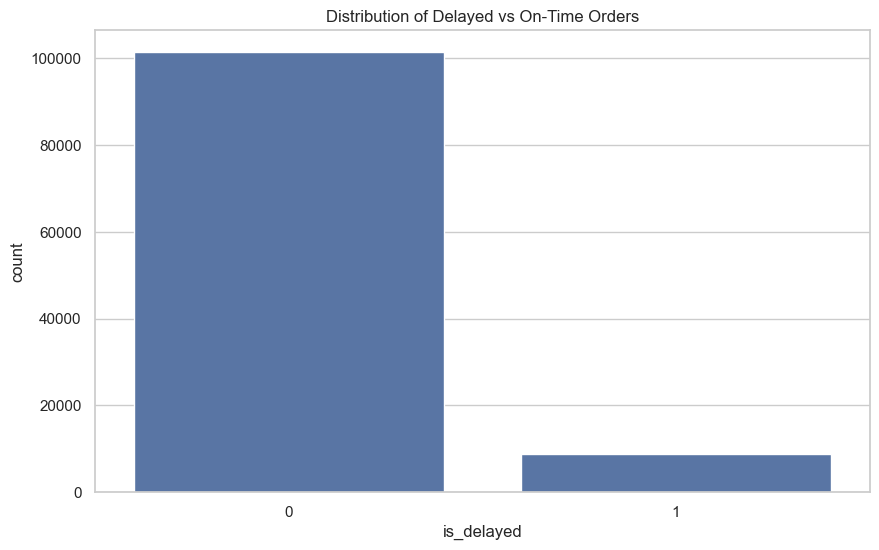
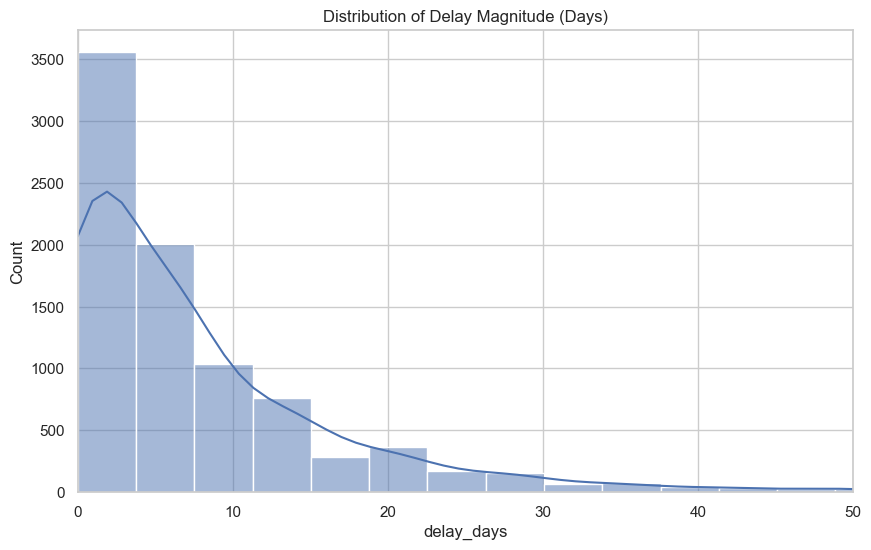
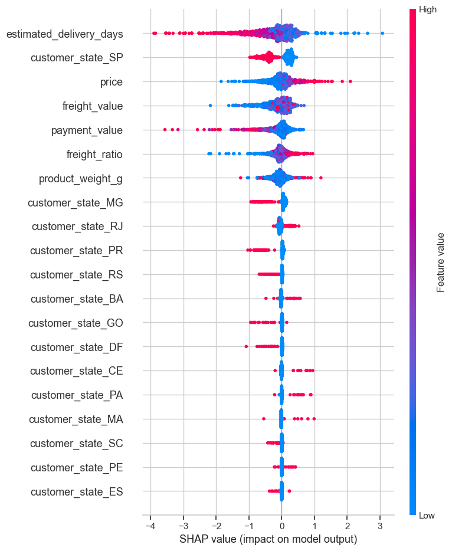

# Phase 2 Mini Project: Order Delay Intelligence

**Goal**: Predict which orders are likely to be delayed and understand why, using the Brazilian E-Commerce Public Dataset by Olist.


```python
%matplotlib inline
import pandas as pd
import numpy as np
import matplotlib.pyplot as plt
import seaborn as sns
import sqlite3
import warnings
warnings.filterwarnings('ignore')

# Scikit-learn & XGBoost
from sklearn.model_selection import train_test_split, cross_val_score, GridSearchCV
from sklearn.preprocessing import StandardScaler, OneHotEncoder
from sklearn.compose import ColumnTransformer
from sklearn.pipeline import Pipeline
from sklearn.linear_model import LogisticRegression
from sklearn.ensemble import RandomForestClassifier
from sklearn.metrics import classification_report, confusion_matrix, roc_auc_score, accuracy_score
import xgboost as xgb
import shap

# Configure visual settings
sns.set_theme(style='whitegrid')
plt.rcParams['figure.figsize'] = (10, 6)
```

## 1. Data Audit & EDA

First, we'll load the relevant datasets and merge them.


```python
base_path = r'F:\Datasets and ML\datasets\Brazilian E-Commerce Public Dataset by Olist'

orders = pd.read_csv(f'{base_path}\\olist_orders_dataset.csv')
items = pd.read_csv(f'{base_path}\\olist_order_items_dataset.csv')
products = pd.read_csv(f'{base_path}\\olist_products_dataset.csv')
customers = pd.read_csv(f'{base_path}\\olist_customers_dataset.csv')
payments = pd.read_csv(f'{base_path}\\olist_order_payments_dataset.csv')

print(f'Orders shape: {orders.shape}')
print(f'Items shape: {items.shape}')
print(f'Products shape: {products.shape}')
print(f'Customers shape: {customers.shape}')
print(f'Payments shape: {payments.shape}')
```

    Orders shape: (99441, 8)
    Items shape: (112650, 7)
    Products shape: (32951, 9)
    Customers shape: (99441, 5)
    Payments shape: (103886, 5)
    

### Merge Datasets
We will join these tables on their respective keys to create a consolidated dataset.


```python
# Join Orders and Customers
df = pd.merge(orders, customers, on='customer_id', how='left')

# Join with Items
df = pd.merge(df, items, on='order_id', how='left')

# Join with Products
df = pd.merge(df, products, on='product_id', how='left')

# Aggregate Payments per order and join
payment_agg = payments.groupby('order_id')['payment_value'].sum().reset_index()
df = pd.merge(df, payment_agg, on='order_id', how='left')

print(f'Merged dataset shape: {df.shape}')
display(df.head())
```

    Merged dataset shape: (113425, 27)
    


<div>
<style scoped>
    .dataframe tbody tr th:only-of-type {
        vertical-align: middle;
    }

    .dataframe tbody tr th {
        vertical-align: top;
    }

    .dataframe thead th {
        text-align: right;
    }
</style>
<table border="1" class="dataframe">
  <thead>
    <tr style="text-align: right;">
      <th></th>
      <th>order_id</th>
      <th>customer_id</th>
      <th>order_status</th>
      <th>order_purchase_timestamp</th>
      <th>order_approved_at</th>
      <th>order_delivered_carrier_date</th>
      <th>order_delivered_customer_date</th>
      <th>order_estimated_delivery_date</th>
      <th>customer_unique_id</th>
      <th>customer_zip_code_prefix</th>
      <th>...</th>
      <th>freight_value</th>
      <th>product_category_name</th>
      <th>product_name_lenght</th>
      <th>product_description_lenght</th>
      <th>product_photos_qty</th>
      <th>product_weight_g</th>
      <th>product_length_cm</th>
      <th>product_height_cm</th>
      <th>product_width_cm</th>
      <th>payment_value</th>
    </tr>
  </thead>
  <tbody>
    <tr>
      <th>0</th>
      <td>e481f51cbdc54678b7cc49136f2d6af7</td>
      <td>9ef432eb6251297304e76186b10a928d</td>
      <td>delivered</td>
      <td>2017-10-02 10:56:33</td>
      <td>2017-10-02 11:07:15</td>
      <td>2017-10-04 19:55:00</td>
      <td>2017-10-10 21:25:13</td>
      <td>2017-10-18 00:00:00</td>
      <td>7c396fd4830fd04220f754e42b4e5bff</td>
      <td>3149</td>
      <td>...</td>
      <td>8.72</td>
      <td>utilidades_domesticas</td>
      <td>40.0</td>
      <td>268.0</td>
      <td>4.0</td>
      <td>500.0</td>
      <td>19.0</td>
      <td>8.0</td>
      <td>13.0</td>
      <td>38.71</td>
    </tr>
    <tr>
      <th>1</th>
      <td>53cdb2fc8bc7dce0b6741e2150273451</td>
      <td>b0830fb4747a6c6d20dea0b8c802d7ef</td>
      <td>delivered</td>
      <td>2018-07-24 20:41:37</td>
      <td>2018-07-26 03:24:27</td>
      <td>2018-07-26 14:31:00</td>
      <td>2018-08-07 15:27:45</td>
      <td>2018-08-13 00:00:00</td>
      <td>af07308b275d755c9edb36a90c618231</td>
      <td>47813</td>
      <td>...</td>
      <td>22.76</td>
      <td>perfumaria</td>
      <td>29.0</td>
      <td>178.0</td>
      <td>1.0</td>
      <td>400.0</td>
      <td>19.0</td>
      <td>13.0</td>
      <td>19.0</td>
      <td>141.46</td>
    </tr>
    <tr>
      <th>2</th>
      <td>47770eb9100c2d0c44946d9cf07ec65d</td>
      <td>41ce2a54c0b03bf3443c3d931a367089</td>
      <td>delivered</td>
      <td>2018-08-08 08:38:49</td>
      <td>2018-08-08 08:55:23</td>
      <td>2018-08-08 13:50:00</td>
      <td>2018-08-17 18:06:29</td>
      <td>2018-09-04 00:00:00</td>
      <td>3a653a41f6f9fc3d2a113cf8398680e8</td>
      <td>75265</td>
      <td>...</td>
      <td>19.22</td>
      <td>automotivo</td>
      <td>46.0</td>
      <td>232.0</td>
      <td>1.0</td>
      <td>420.0</td>
      <td>24.0</td>
      <td>19.0</td>
      <td>21.0</td>
      <td>179.12</td>
    </tr>
    <tr>
      <th>3</th>
      <td>949d5b44dbf5de918fe9c16f97b45f8a</td>
      <td>f88197465ea7920adcdbec7375364d82</td>
      <td>delivered</td>
      <td>2017-11-18 19:28:06</td>
      <td>2017-11-18 19:45:59</td>
      <td>2017-11-22 13:39:59</td>
      <td>2017-12-02 00:28:42</td>
      <td>2017-12-15 00:00:00</td>
      <td>7c142cf63193a1473d2e66489a9ae977</td>
      <td>59296</td>
      <td>...</td>
      <td>27.20</td>
      <td>pet_shop</td>
      <td>59.0</td>
      <td>468.0</td>
      <td>3.0</td>
      <td>450.0</td>
      <td>30.0</td>
      <td>10.0</td>
      <td>20.0</td>
      <td>72.20</td>
    </tr>
    <tr>
      <th>4</th>
      <td>ad21c59c0840e6cb83a9ceb5573f8159</td>
      <td>8ab97904e6daea8866dbdbc4fb7aad2c</td>
      <td>delivered</td>
      <td>2018-02-13 21:18:39</td>
      <td>2018-02-13 22:20:29</td>
      <td>2018-02-14 19:46:34</td>
      <td>2018-02-16 18:17:02</td>
      <td>2018-02-26 00:00:00</td>
      <td>72632f0f9dd73dfee390c9b22eb56dd6</td>
      <td>9195</td>
      <td>...</td>
      <td>8.72</td>
      <td>papelaria</td>
      <td>38.0</td>
      <td>316.0</td>
      <td>4.0</td>
      <td>250.0</td>
      <td>51.0</td>
      <td>15.0</td>
      <td>15.0</td>
      <td>28.62</td>
    </tr>
  </tbody>
</table>
<p>5 rows × 27 columns</p>
</div>


### Handle Missing Values and Date Formatting


```python
date_cols = ['order_purchase_timestamp', 'order_approved_at', 'order_delivered_carrier_date',
             'order_delivered_customer_date', 'order_estimated_delivery_date']

for col in date_cols:
    df[col] = pd.to_datetime(df[col])
    
print("Missing Values:\n", df.isnull().sum()[df.isnull().sum() > 0])
```

    Missing Values:
     order_approved_at                 161
    order_delivered_carrier_date     1968
    order_delivered_customer_date    3229
    order_item_id                     775
    product_id                        775
    seller_id                         775
    shipping_limit_date               775
    price                             775
    freight_value                     775
    product_category_name            2378
    product_name_lenght              2378
    product_description_lenght       2378
    product_photos_qty               2378
    product_weight_g                  793
    product_length_cm                 793
    product_height_cm                 793
    product_width_cm                  793
    payment_value                       3
    dtype: int64
    

### Target Variable: `is_delayed`

We define an order as delayed if `order_delivered_customer_date` is strictly greater than `order_estimated_delivery_date`.


```python
# Filter for delivered orders only
df = df[df['order_status'] == 'delivered'].copy()

# Create target variable
df['is_delayed'] = (df['order_delivered_customer_date'] > df['order_estimated_delivery_date']).astype(int)

delay_rate = df['is_delayed'].mean()
print(f'Overall Delay Rate: {delay_rate:.2%}')

sns.countplot(data=df, x='is_delayed')
plt.title('Distribution of Delayed vs On-Time Orders')
plt.show()
```

    Overall Delay Rate: 7.91%
    


    

    


### Delay Magnitude

The business also wants to understand *how large* the delay might be for orders that miss their estimated delivery date.


```python
# Calculate delay in days for delayed orders
df['delay_days'] = (df['order_delivered_customer_date'] - df['order_estimated_delivery_date']).dt.days

delayed_orders = df[df['is_delayed'] == 1]

print(f"Average delay for delayed orders: {delayed_orders['delay_days'].mean():.1f} days")
print(f"Median delay for delayed orders: {delayed_orders['delay_days'].median():.1f} days")
print(f"90th percentile of delay: {delayed_orders['delay_days'].quantile(0.90):.1f} days")

sns.histplot(data=delayed_orders, x='delay_days', bins=50, kde=True)
plt.title('Distribution of Delay Magnitude (Days)')
plt.xlim(0, 50)
plt.show()
```

    Average delay for delayed orders: 8.7 days
    Median delay for delayed orders: 5.0 days
    90th percentile of delay: 20.0 days
    


    

    


## 2. SQL Practice

We will dump our dataset into a local SQLite database to practice extracting insights using SQL.


```python
conn = sqlite3.connect(':memory:')
df.to_sql('orders_data', conn, index=False, if_exists='replace')

# Query 1: Delay rate by state
query_state = '''
SELECT customer_state, 
       COUNT(order_id) as total_orders,
       SUM(is_delayed) as delayed_orders,
       ROUND(CAST(SUM(is_delayed) AS FLOAT) / COUNT(order_id) * 100, 2) as delay_rate_percent
FROM orders_data
GROUP BY customer_state
HAVING total_orders > 100
ORDER BY delay_rate_percent DESC
LIMIT 10
'''
print("Top 10 States by Delay Rate:")
display(pd.read_sql(query_state, conn))
```

    Top 10 States by Delay Rate:
    


<div>
<style scoped>
    .dataframe tbody tr th:only-of-type {
        vertical-align: middle;
    }

    .dataframe tbody tr th {
        vertical-align: top;
    }

    .dataframe thead th {
        text-align: right;
    }
</style>
<table border="1" class="dataframe">
  <thead>
    <tr style="text-align: right;">
      <th></th>
      <th>customer_state</th>
      <th>total_orders</th>
      <th>delayed_orders</th>
      <th>delay_rate_percent</th>
    </tr>
  </thead>
  <tbody>
    <tr>
      <th>0</th>
      <td>AL</td>
      <td>427</td>
      <td>103</td>
      <td>24.12</td>
    </tr>
    <tr>
      <th>1</th>
      <td>MA</td>
      <td>800</td>
      <td>163</td>
      <td>20.38</td>
    </tr>
    <tr>
      <th>2</th>
      <td>SE</td>
      <td>375</td>
      <td>61</td>
      <td>16.27</td>
    </tr>
    <tr>
      <th>3</th>
      <td>PI</td>
      <td>523</td>
      <td>81</td>
      <td>15.49</td>
    </tr>
    <tr>
      <th>4</th>
      <td>CE</td>
      <td>1426</td>
      <td>218</td>
      <td>15.29</td>
    </tr>
    <tr>
      <th>5</th>
      <td>BA</td>
      <td>3683</td>
      <td>504</td>
      <td>13.68</td>
    </tr>
    <tr>
      <th>6</th>
      <td>RJ</td>
      <td>14143</td>
      <td>1835</td>
      <td>12.97</td>
    </tr>
    <tr>
      <th>7</th>
      <td>PA</td>
      <td>1054</td>
      <td>131</td>
      <td>12.43</td>
    </tr>
    <tr>
      <th>8</th>
      <td>TO</td>
      <td>310</td>
      <td>38</td>
      <td>12.26</td>
    </tr>
    <tr>
      <th>9</th>
      <td>ES</td>
      <td>2225</td>
      <td>272</td>
      <td>12.22</td>
    </tr>
  </tbody>
</table>
</div>


```python
# Query 2: Delay rate by product category
query_category = '''
SELECT product_category_name, 
       COUNT(order_id) as total_orders,
       ROUND(CAST(SUM(is_delayed) AS FLOAT) / COUNT(order_id) * 100, 2) as delay_rate_percent
FROM orders_data
WHERE product_category_name IS NOT NULL
GROUP BY product_category_name
HAVING total_orders > 50
ORDER BY delay_rate_percent DESC
LIMIT 10
'''
print("\nTop 10 Product Categories by Delay Rate:")
display(pd.read_sql(query_category, conn))
```

    
    Top 10 Product Categories by Delay Rate:
    


<div>
<style scoped>
    .dataframe tbody tr th:only-of-type {
        vertical-align: middle;
    }

    .dataframe tbody tr th {
        vertical-align: top;
    }

    .dataframe thead th {
        text-align: right;
    }
</style>
<table border="1" class="dataframe">
  <thead>
    <tr style="text-align: right;">
      <th></th>
      <th>product_category_name</th>
      <th>total_orders</th>
      <th>delay_rate_percent</th>
    </tr>
  </thead>
  <tbody>
    <tr>
      <th>0</th>
      <td>audio</td>
      <td>362</td>
      <td>12.71</td>
    </tr>
    <tr>
      <th>1</th>
      <td>fashion_underwear_e_moda_praia</td>
      <td>127</td>
      <td>12.60</td>
    </tr>
    <tr>
      <th>2</th>
      <td>artigos_de_natal</td>
      <td>150</td>
      <td>12.00</td>
    </tr>
    <tr>
      <th>3</th>
      <td>livros_tecnicos</td>
      <td>263</td>
      <td>11.03</td>
    </tr>
    <tr>
      <th>4</th>
      <td>casa_conforto</td>
      <td>429</td>
      <td>10.26</td>
    </tr>
    <tr>
      <th>5</th>
      <td>construcao_ferramentas_iluminacao</td>
      <td>301</td>
      <td>9.97</td>
    </tr>
    <tr>
      <th>6</th>
      <td>alimentos</td>
      <td>499</td>
      <td>9.82</td>
    </tr>
    <tr>
      <th>7</th>
      <td>eletronicos</td>
      <td>2729</td>
      <td>9.75</td>
    </tr>
    <tr>
      <th>8</th>
      <td>beleza_saude</td>
      <td>9465</td>
      <td>9.05</td>
    </tr>
    <tr>
      <th>9</th>
      <td>moveis_escritorio</td>
      <td>1668</td>
      <td>8.93</td>
    </tr>
  </tbody>
</table>
</div>


## 3. Feature Engineering & Preprocessing

We need to create useful features that models can learn from, such as the estimated time to delivery, freight value, order price, and customer state.


```python
# Feature Engineering
df['estimated_delivery_days'] = (df['order_estimated_delivery_date'] - df['order_purchase_timestamp']).dt.days
df['freight_ratio'] = df['freight_value'] / df['payment_value'].replace(0, 1) # Avoid division by zero

# Select features
features = ['payment_value', 'freight_value', 'price', 'product_weight_g', 
            'estimated_delivery_days', 'customer_state', 'freight_ratio']

model_df = df.dropna(subset=features + ['is_delayed']).copy()

X = model_df[features]
y = model_df['is_delayed']

print(f"Shape of X: {X.shape}")
```

    Shape of X: (110176, 7)
    


```python
# Split the data
X_train, X_test, y_train, y_test = train_test_split(X, y, test_size=0.2, random_state=42, stratify=y)

# Preprocessing pipelines
numeric_features = ['payment_value', 'freight_value', 'price', 'product_weight_g', 'estimated_delivery_days', 'freight_ratio']
categorical_features = ['customer_state']

preprocessor = ColumnTransformer(
    transformers=[
        ('num', StandardScaler(), numeric_features),
        ('cat', OneHotEncoder(handle_unknown='ignore', sparse_output=False), categorical_features)
    ])
```

## 4. Baseline Models
Let's train Logistic Regression and Random Forest as baselines.


```python
# Logistic Regression Pipeline
lr_pipeline = Pipeline(steps=[('preprocessor', preprocessor),
                              ('classifier', LogisticRegression(class_weight='balanced', max_iter=1000, random_state=42))])

lr_pipeline.fit(X_train, y_train)
y_pred_lr = lr_pipeline.predict(X_test)
print("Logistic Regression AUC:", roc_auc_score(y_test, lr_pipeline.predict_proba(X_test)[:, 1]))
print("\nClassification Report (Logistic Regression):\n", classification_report(y_test, y_pred_lr))
```

    Logistic Regression AUC: 0.6849554657895187
    
    Classification Report (Logistic Regression):
                   precision    recall  f1-score   support
    
               0       0.95      0.65      0.77     20294
               1       0.13      0.63      0.22      1742
    
        accuracy                           0.65     22036
       macro avg       0.54      0.64      0.50     22036
    weighted avg       0.89      0.65      0.73     22036
    
    


```python
# Random Forest Pipeline (limited depth for speed initially)
rf_pipeline = Pipeline(steps=[('preprocessor', preprocessor),
                              ('classifier', RandomForestClassifier(n_estimators=100, max_depth=10, class_weight='balanced', random_state=42, n_jobs=-1))])

rf_pipeline.fit(X_train, y_train)
y_pred_rf = rf_pipeline.predict(X_test)
print("Random Forest AUC:", roc_auc_score(y_test, rf_pipeline.predict_proba(X_test)[:, 1]))
print("\nClassification Report (Random Forest):\n", classification_report(y_test, y_pred_rf))
```

    Random Forest AUC: 0.7155565059299932
    
    Classification Report (Random Forest):
                   precision    recall  f1-score   support
    
               0       0.95      0.75      0.84     20294
               1       0.16      0.56      0.25      1742
    
        accuracy                           0.74     22036
       macro avg       0.56      0.66      0.55     22036
    weighted avg       0.89      0.74      0.79     22036
    
    

## 5. XGBoost Model & Tuning
Now we'll use XGBoost which often provides strong performance on tabular data.


```python
import xgboost as xgb

# We'll use scale_pos_weight for class imbalance
scale_pos_weight = (len(y_train) - sum(y_train)) / sum(y_train)

xgb_pipeline = Pipeline(steps=[
    ('preprocessor', preprocessor),
    ('classifier', xgb.XGBClassifier(use_label_encoder=False, eval_metric='logloss', 
                                     scale_pos_weight=scale_pos_weight, random_state=42))
])

xgb_pipeline.fit(X_train, y_train)
y_pred_xgb = xgb_pipeline.predict(X_test)
print("XGBoost AUC:", roc_auc_score(y_test, xgb_pipeline.predict_proba(X_test)[:, 1]))
print("\nClassification Report (XGBoost):\n", classification_report(y_test, y_pred_xgb))
```

    XGBoost AUC: 0.7309231110935607
    
    Classification Report (XGBoost):
                   precision    recall  f1-score   support
    
               0       0.95      0.75      0.84     20294
               1       0.17      0.57      0.26      1742
    
        accuracy                           0.74     22036
       macro avg       0.56      0.66      0.55     22036
    weighted avg       0.89      0.74      0.80     22036
    
    

### Cross-Validation

To ensure our model's performance is stable, we evaluate it using 5-fold cross-validation on the training set.


```python
# Perform 5-fold Cross Validation for ROC-AUC
cv_scores = cross_val_score(xgb_pipeline, X_train, y_train, cv=5, scoring='roc_auc', n_jobs=-1)

print(f"XGBoost CV ROC-AUC Scores: {cv_scores}")
print(f"Average CV ROC-AUC: {cv_scores.mean():.4f} (+/- {cv_scores.std() * 2:.4f})")
```

    XGBoost CV ROC-AUC Scores: [0.72798479 0.71990631 0.73357659 0.73220851 0.73382757]
    Average CV ROC-AUC: 0.7295 (+/- 0.0105)
    

## 6. Model Interpretation (SHAP)
Understanding which features drive the prediction of delay.


```python
# Extract preprocessed data and model
X_train_preprocessed = preprocessor.fit_transform(X_train)
X_test_preprocessed = preprocessor.transform(X_test)
model = xgb_pipeline.named_steps['classifier']

# Get feature names after one-hot encoding
cat_features = preprocessor.named_transformers_['cat'].get_feature_names_out(categorical_features)
all_features = numeric_features + list(cat_features)

# Convert back to DataFrame for SHAP
X_train_sh = pd.DataFrame(X_train_preprocessed, columns=all_features)
X_test_sh = pd.DataFrame(X_test_preprocessed, columns=all_features)

# Create SHAP Explainer
# Using a sample to speed up SHAP values calculation
explainer = shap.TreeExplainer(model)
shap_values = explainer.shap_values(X_test_sh.sample(1000, random_state=42))

# Plot SHAP summary
shap.summary_plot(shap_values, X_test_sh.sample(1000, random_state=42))
```


    

    


```python

```


```python

```


```python

```
